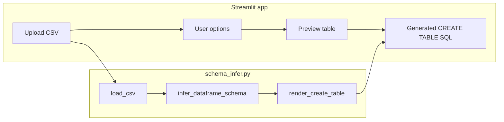

# CSV → CREATE TABLE

A small tool that reads a **CSV file**, infers **SQL-oriented column types** from the text in each column, and prints a **`CREATE TABLE`** statement for **PostgreSQL**, **SQLite**, or **Microsoft SQL Server**. The web UI is built with [Streamlit](https://streamlit.io/); inference and DDL generation live in a separate Python module so they can be reused (for example from tests or a future CLI).

---

## Quick start

```bash
python -m venv .venv
.venv\Scripts\activate          # Windows
# source .venv/bin/activate     # macOS / Linux

pip install -r requirements.txt
streamlit run app.py
```

Open the URL Streamlit prints (usually `http://localhost:8501`), upload a `.csv` file, choose a dialect and options, and copy the generated SQL into your database client.

---

## How it works (end-to-end)



1. **`load_csv`** reads the file with [Polars](https://pola.rs/), scans the full file, and casts **every column to UTF-8 strings**. That way mixed-type columns (e.g. numbers and `N/A`) stay as text and are classified as character data instead of being coerced to numbers and failing inference.
2. **`infer_dataframe_schema`** walks each column, derives a **`ColumnInference`** (logical kind, nullability, string length or numeric precision, etc.), and builds safe SQL identifiers from header names (sanitize, deduplicate, quote reserved words per dialect).
3. **`render_create_table`** maps each inferred kind to a concrete SQL type for the selected dialect and emits the `CREATE TABLE` statement.

Nothing is written to a database; you only get text to run manually (or paste into migrations).

---

## Web UI (`app.py`)

| Control | Purpose |
|--------|---------|
| **Upload** | CSV file; required for generation. |
| **SQL dialect** | `postgresql`, `sqlite`, or `sqlserver` — changes types and identifier quoting (`"…"`, `[…]`, etc.). |
| **Table name** | Logical name for the table. Defaults from the uploaded filename. It is sanitized (safe characters, lowercase base name) before use in SQL. |
| **Preview rows** | How many rows of the parsed frame to show (1–500); does not affect inference (the whole file is still read). |
| **Nullability** | **Safe** — every column is nullable in DDL (good for messy imports). **Strict** — `NOT NULL` only where every non-empty row has a value in that column. |
| **CREATE TABLE IF NOT EXISTS** | Adds `IF NOT EXISTS` where the dialect supports it. On SQL Server, that form needs **SQL Server 2016+**. |

After upload, the app shows a **data preview** and the **generated SQL** in a code block.

---

## Schema inference (`schema_infer.py`)

Inference runs **per column** on the string values Polars holds after `load_csv`. Empty cells count toward **nullable** behavior in strict mode.

**Order of checks** (first match wins):

1. **All empty** → `VARCHAR` with a minimum length of 1.
2. **All values parse as integers** → `INTEGER` if every value fits 32-bit signed range, else `BIGINT`.
3. **All values match boolean tokens** (`true`/`false`, `1`/`0`, `yes`/`no`, etc.) → `BOOLEAN`. Integers are checked *before* booleans so values like `1`/`2` become integers, not booleans.
4. **All values parse as decimals** → `NUMERIC` with inferred precision and scale.
5. **All values parse as dates/times** (several formats + ISO) → `DATE` if no time component appears in any row, else `TIMESTAMP`.
6. Otherwise → **`VARCHAR(n)`** where `n` is the maximum trimmed string length in that column (per dialect, very long strings may map to `TEXT` / `NVARCHAR(MAX)`).

**Identifiers:** Header names are sanitized to safe SQL-ish names; duplicates get numeric suffixes (`name`, `name_2`, …). Names that collide with **reserved words** for the chosen dialect are **quoted** (`"order"` in PostgreSQL, `[order]` in SQL Server, etc.).

---

## Dialect differences (summary)

The same logical `ColumnInference` maps to different physical types:

| Logical kind | PostgreSQL | SQLite | SQL Server |
|--------------|------------|--------|------------|
| Boolean | `BOOLEAN` | stored as `INTEGER` affinity | `BIT` |
| Integer / Bigint | `INTEGER` / `BIGINT` | `INTEGER` | `INT` / `BIGINT` |
| Numeric | `NUMERIC(p,s)` | `NUMERIC(p,s)` | `DECIMAL(p,s)` |
| Date / Timestamp | `DATE` / `TIMESTAMP` | `TEXT` (DDL) | `DATE` / `DATETIME2(7)` |
| Varchar | `VARCHAR(n)` or `TEXT` if huge | `TEXT` | `NVARCHAR(n)` or `NVARCHAR(MAX)` |

Always review generated DDL against your real requirements (indexes, constraints, charset, and precision).

---

## Core API (for scripts / tests)

Main entry points:

- `load_csv(source)` → `pl.DataFrame` (all string columns).
- `infer_dataframe_schema(df)` → `list[ColumnInference]`.
- `render_create_table(table_name, columns, dialect, …)` → `str` (DDL).

Helpers such as `infer_column`, `sanitize_column_names`, and `quote_identifier` are available for finer-grained use; see docstrings in [`schema_infer.py`](schema_infer.py).

---

## Project layout

| Path | Role |
|------|------|
| [`app.py`](app.py) | Streamlit UI. |
| [`schema_infer.py`](schema_infer.py) | CSV load, inference, DDL rendering. |
| [`tests/test_infer.py`](tests/test_infer.py) | Pytest suite for inference and DDL. |
| [`samples/`](samples/) | Example CSVs for manual testing — see [`samples/README.md`](samples/README.md). |
| [`scripts/generate_large_csv.py`](scripts/generate_large_csv.py) | Optional generator for large stress-test files. |

---

## Tests

```bash
pytest tests/test_infer.py -v
```

---

## Limitations and practical notes

- **Whole file in memory:** The CSV is loaded fully for inference. Very large files can be slow or exhaust RAM; see sizing notes in [`samples/README.md`](samples/README.md).
- **Inference is heuristic:** Strange outliers, locale-specific numbers, or inconsistent date formats may produce wider types (`VARCHAR`) or types you might hand-tune afterward.
- **No `INSERT` statements:** This project generates **table DDL only** (unless you extend it).
- **Clipboard / browser:** If you add client-side copy buttons later, some browsers only expose the clipboard on **HTTPS** or **localhost**.

---

## Requirements

See [`requirements.txt`](requirements.txt): Polars, Streamlit, Pytest (for development).
